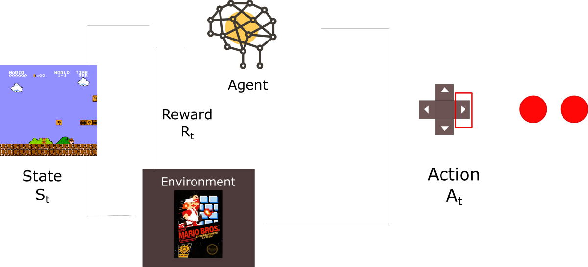

# AIにゲームを遊んでもらった

## 背景

FAQボットに関して、「役に立ったか？」の質問で、皆さんのYes/Noの回答によって、より回答の精度を上げたい。

強化学習は上記を対応できそう。現在はその中の一つの手法（Deep Q-learning）を勉強中。

入門編は、CartPoleと言うゲームをAIが学習して遊ぶ。

参考コードをDLして色々弄ってみた。


### どんなゲーム

<http://fluxml.ai/experiments/cartPole/>

### AIの学習の様子

デモ

```
$ python3 dqn.py
```

## 実現の仕方




### 擬似コード

```

ゲーム状態初期化(state)

	冒険か・推測かを決める
	
	アクション(action)を選択する
	
	報酬(reward)及び次の状態(new_state)を入手
	
	上記の経験を記憶する
	
	状態を更新（state = new_state）
	
	記憶した経験から訓練用データを抽出
	
	学習（推測精度を高めるようパラメータ更新）
	
	繰り返し（アクション）
	
繰り返し（ゲーム）

```

## 今後の発展

* FAQボットの改善
* ゲームの自動プレー？？

### Usage

```
$ python3 dqn.py
```


## 参考

[1] <http://fluxml.ai/experiments/cartPole/>

[2] <https://medium.freecodecamp.org/an-introduction-to-reinforcement-learning-4339519de419>

[3] <https://keon.io/deep-q-learning/>


